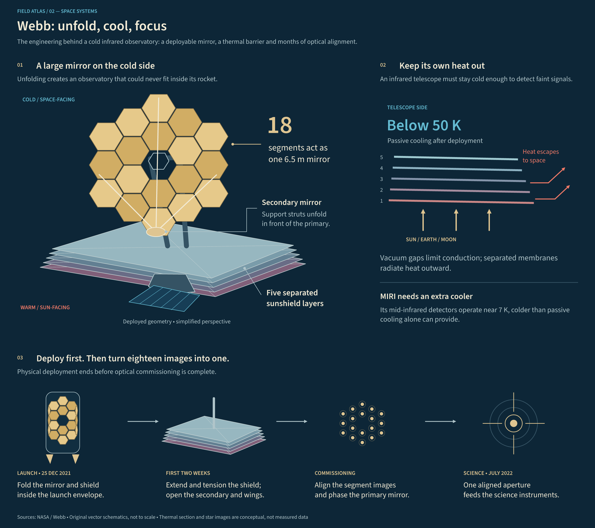
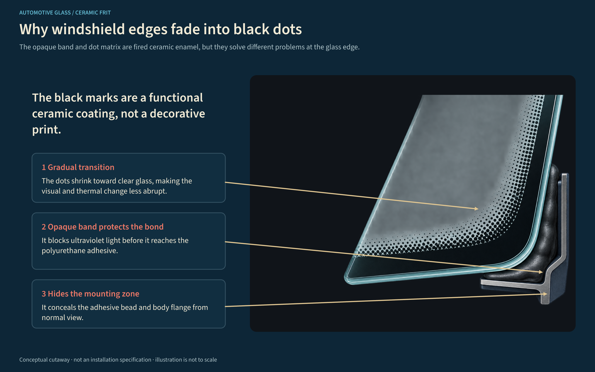
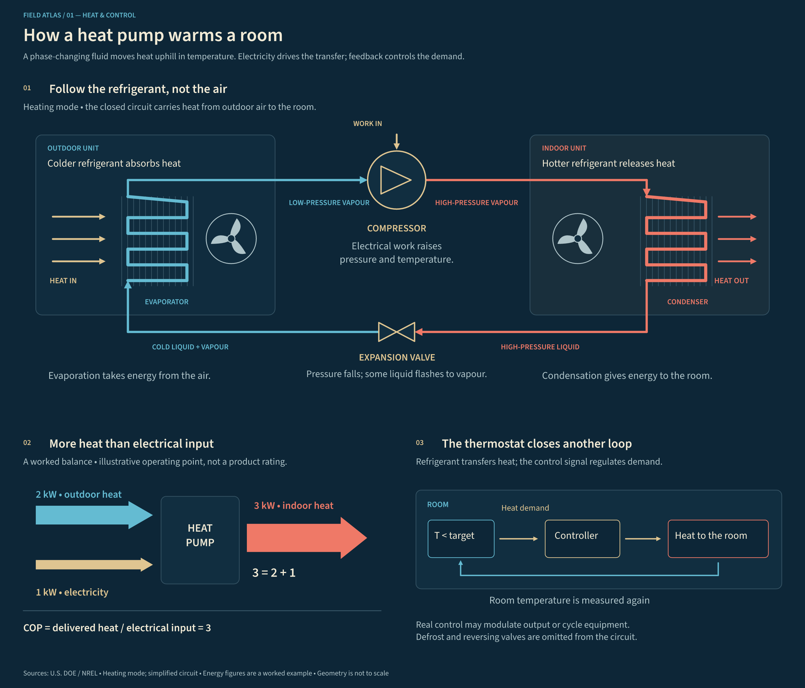
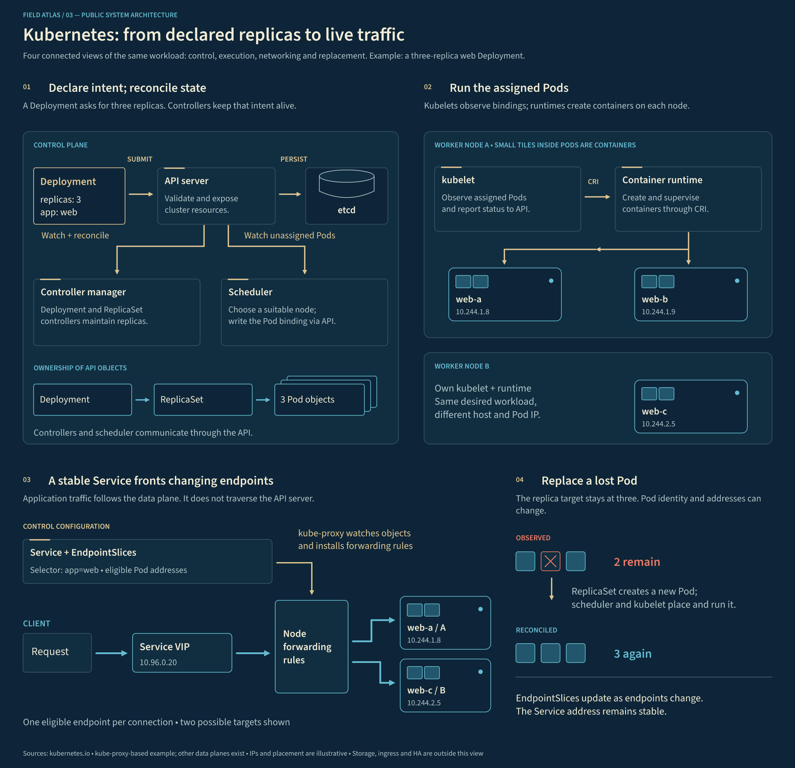
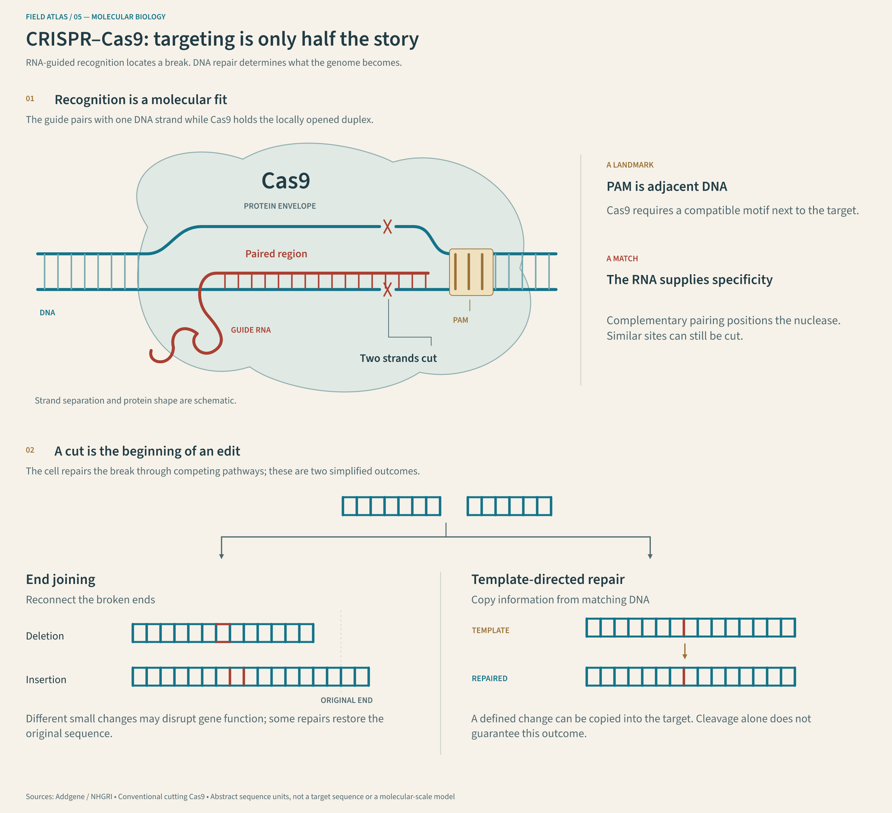
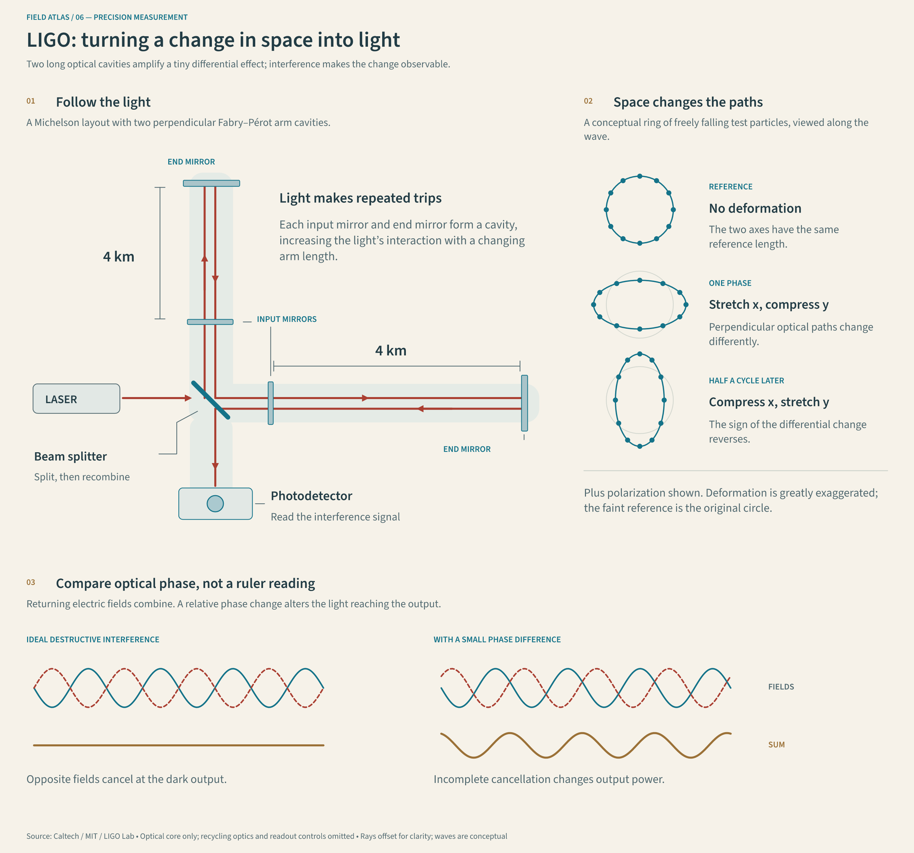
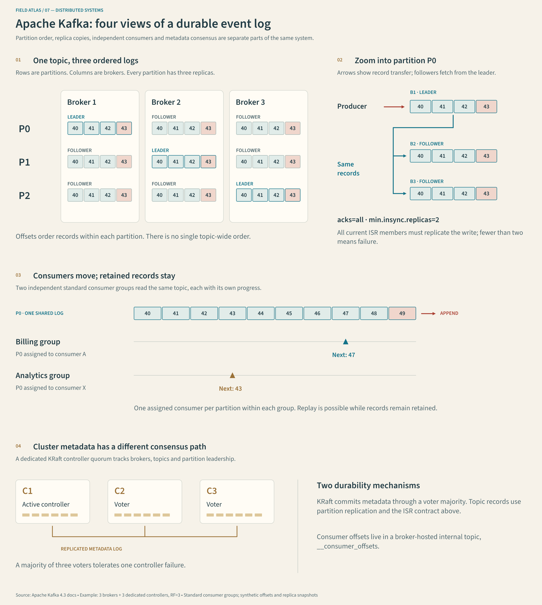

# Infographic Studio

**Illustrated explanations. Editable by design.**

Turn technical content into figures that combine drawings, spatial relationships and precise annotations. Infographic Studio is a small composition engine with a CLI, a versioned scene format and an agent skill that uses the same workflow.

An agent develops the explanation and authors the scene. The engine lays out text, composes vector artwork and local images, checks mechanical issues, and exports **SVG, PNG and PDF**. Correct a label without generating the illustration again.



[Editable Webb scene](examples/space/jwst-deployment/scene.json) · [PNG](examples/space/jwst-deployment/rendered/figure.png) · [PDF](examples/space/jwst-deployment/rendered/figure.pdf)

**Alpha preview — 0.1.0-alpha.4.** Suitable for experimentation and reviewed figures. The API and layout contract may change before a stable release. Automatic checks do not establish scientific correctness or visual quality. See the [changelog](CHANGELOG.md) for scope and known limitations.

## Try it

Requires **Node.js 22+**. Start from a cloned or downloaded copy of this repository. The included examples run entirely offline after installation. No browser, API key or image-generation service is needed.

```sh
cd infographic-studio
npm ci

node cli/cli.js init my-figure
node cli/cli.js render my-figure/scene.json --out output --strict
```

Open `output/figure.png` or `output/figure.pdf`. Change a label, a shape or the theme in `my-figure/scene.json`, then render again. The exports contain embedded fonts and images; they do not depend on remote resources.

Use `init my-figure --example windshield` for a physical cutaway, `--example jwst` for telescope geometry and optical commissioning, `--example heat-pump` for a refrigerant circuit with an energy balance and feedback, or `--example kubernetes` for control, execution, traffic and recovery views. `windshield` is the default starter; `thermostat` remains an alias for `heat-pump`. Initialization copies the editable scene and its image assets into a **new directory** and refuses any existing destination. Image prompts and provenance remain in the scene.

For the light series, use `--example crispr` for molecular recognition and DNA repair, `--example ligo` for an optical interferometer and phase comparison, or `--example kafka` for partition replication, consumer progress and KRaft metadata.

For a global CLI install from the local checkout:

```sh
npm install -g .
infographic-studio init my-figure --example kubernetes
infographic-studio render my-figure/scene.json --out output
```

These commands install from the checkout and do not require a published npm package.

## What you can build

- Illustrated scientific explanations: rays, waveforms, layers, boundaries and physical relationships.
- Engineering figures: devices, cutaways, monitoring stations and annotated systems.
- Hybrid compositions: generated or supplied PNG/JPEG artwork with editable vector text, callouts and geometry.
- Consistent figures across a report, with shared color tokens and bundled typography.

Author spatial layouts directly in a scene, or use automatic illustrated-object layout for related objects and processes. The gallery shares Source Sans 3 typography, a consistent outline vocabulary and numbered editorial sections across two coordinated directions: **technical blueprint** uses a navy ground and ivory text; **paper atlas** uses a warm light ground and dark teal ink. Both use teal structure, coral emphasis and ochre annotations. Semantic documents default to blueprint unless a source chooses another theme.

| Physical cutaway | Space engineering |
| --- | --- |
| [](examples/windshield-frit/scene.json) | [](examples/space/jwst-deployment/scene.json) |
| [SVG](examples/windshield-frit/rendered/figure.svg) · [PDF](examples/windshield-frit/rendered/figure.pdf) | [SVG](examples/space/jwst-deployment/rendered/figure.svg) · [PDF](examples/space/jwst-deployment/rendered/figure.pdf) |

| Refrigerant circuit, energy and control | Public-project architecture |
| --- | --- |
| [](examples/physical/heat-pump/scene.json) | [](examples/architectures/kubernetes-cluster/scene.json) |
| [SVG](examples/physical/heat-pump/rendered/figure.svg) · [PDF](examples/physical/heat-pump/rendered/figure.pdf) | [SVG](examples/architectures/kubernetes-cluster/rendered/figure.svg) · [PDF](examples/architectures/kubernetes-cluster/rendered/figure.pdf) |

The [Kubernetes figure](examples/architectures/kubernetes-cluster/scene.json) follows one three-replica workload through four views: API resources and controllers, containers nested inside Pods and nodes, Service forwarding, and replacement of a lost Pod. It is based on the official [architecture](https://kubernetes.io/docs/concepts/architecture/) and [Service networking](https://kubernetes.io/docs/reference/networking/virtual-ips/) documentation. It illustrates a kube-proxy-based configuration, not every possible cluster topology.

The [Webb figure](examples/space/jwst-deployment/scene.json) combines an eighteen-segment mirror and deployed sunshield, an annotated thermal section, and changes from launch configuration to an aligned aperture. Sources include NASA's [sunshield explanation](https://science.nasa.gov/mission/webb/webbs-sunshield/) and [deployment record](https://science.nasa.gov/mission/webb/deployment/).

The [heat-pump figure](examples/physical/heat-pump/scene.json) follows refrigerant through both coils, the compressor and expansion valve. An illustrative energy balance and a separate thermostat loop explain heat transfer and regulation. It follows the U.S. Department of Energy's [HVAC guide](https://www1.eere.energy.gov/buildings/publications/pdfs/building_america/hvac_guide.pdf). Each example has a `brief.json` describing its thesis, visual evidence, sources and deliberate simplifications.

### Paper atlas: complex subjects in a light theme

| Molecular recognition and repair | Precision optical measurement | Distributed event storage |
| --- | --- | --- |
| [](examples/biology/crispr-cas9/scene.json) | [](examples/physical/ligo-interferometer/scene.json) | [](examples/architectures/apache-kafka/scene.json) |
| [SVG](examples/biology/crispr-cas9/rendered/figure.svg) · [PDF](examples/biology/crispr-cas9/rendered/figure.pdf) | [SVG](examples/physical/ligo-interferometer/rendered/figure.svg) · [PDF](examples/physical/ligo-interferometer/rendered/figure.pdf) | [SVG](examples/architectures/apache-kafka/rendered/figure.svg) · [PDF](examples/architectures/apache-kafka/rendered/figure.pdf) |

**CRISPR–Cas9** combines an original molecular schematic, a locally opened DNA duplex and a comparison of repair outcomes. Abstract sequence units explain the mechanism without representing an actual target. Based on [Addgene's CRISPR guide](https://www.addgene.org/guides/crispr/) and [NHGRI](https://www.genome.gov/genetics-glossary/CRISPR).

**LIGO** follows light through two perpendicular arm cavities, compares alternating strain states and illustrates how optical fields combine. Beam separation and deformation are exaggerated; the waveforms are conceptual. Based on the LIGO Lab explanations of [interferometry](https://www.ligo.caltech.edu/MIT/page/what-is-interferometer) and [LIGO's instrument](https://www.ligo.caltech.edu/WA/page/ligos-ifo).

**Apache Kafka** uses a broker-by-partition matrix, an expanded replication path, aligned consumer cursors and a separate metadata quorum. It illustrates a three-broker cluster with standard consumer groups, using the public project's [4.3 design](https://kafka.apache.org/43/design/design/), [KRaft](https://kafka.apache.org/43/operations/kraft/) and [topic configuration](https://kafka.apache.org/43/configuration/topic-configs/) documentation.

## How it works

```text
Technical brief + sources + visual direction
                    ↓ agent authors
                scene.json ← local illustration assets
                    ↓
       validate → compose → export → visual review
                    ↓
        figure.svg · figure.png · figure.pdf · report.json
```

The scene separates **content**, **artwork** and **presentation**. It is ordinary JSON with stable element IDs. Text stays as SVG text nodes and PDF text, rather than becoming pixels or outlines. PNG is the raster delivery format. Imported raster illustrations remain raster in every output.

The engine uses nine drawing primitives, anchored callouts and bundled vector icons. A callout combines wrapping text, a leader and an anchor tied to an object; the anchor follows that object when it moves or resizes. Panels provide local coordinates, optional grids and optional frames for open compositions. Source Sans 3 supplies consistent text metrics and glyph coverage across exports.

Three built-in themes—`blueprint`, `paper`, and `midnight`—can be customized with palette tokens. You can author arbitrary vector shapes with SVG path data while retaining strict schema validation.

Read the [scene format guide](skills/infographic-studio/references/scene-format.md) or use the [JSON Schema](schema/scene.schema.json) in your editor.

## CLI

| Command | Result |
| --- | --- |
| `init <directory> --example windshield` | Copy the default editable physical cutaway; never overwrite an existing scene |
| `init <directory> --example kubernetes` | Copy an editable architecture figure with control and traffic views |
| `check <scene.json> --strict` | Check schema, panel geometry, text layout and local assets |
| `check <scene.json> --json` | Machine-readable check report |
| `render <scene.json> --out output` | Export SVG, PNG, PDF and a report |
| `render <scene.json> --formats svg,png --scale 2` | Select formats and PNG scale |
| `assets <scene.json>` | Emit illustration prompts and placement dimensions as JSON |
| `labels <scene.json> --out labels.json` | Export visible text keyed by stable element ID; refuse an existing output file |
| `revise <scene.json> --labels changes.json --out revision --strict` | Create a separate project with corrected text and copied images |
| `render <scene.json> --print-width 180 --min-font 8` | Export a PDF at 180 mm width and report text below 8 pt |
| `icons payment --json` | Search the bundled outline catalog by name and tags |
| `compose <specification.json> --out scene.json` | Compile a semantic infographic/document or expand explicit component placements into a new scene; refuse overwrite |

`render` replaces the named exports in the output directory. `--strict` makes warnings fail the command, and errors always fail. Exit codes are `0` for success and `1` for invalid input or failed checks/exports.

Reports record findings, output formats, scene and asset hashes, and the need for scientific review. SVG and PNG generation is deterministic for the same scene, assets and installed dependency versions. PDF metadata contains generation timestamps, so PDF bytes need not match across runs.

## Use a consistent icon family

The initial catalog contains **17 Tabler outline icons**, pinned to a recorded source revision. Rendering is offline. Names, tags, author, license, source URL and content hash are available through `icons --json` or the `listIcons(query)` API.

```json
{
  "id": "wallet-symbol", "type": "icon", "icon": "tabler/wallet",
  "x": 80, "y": 120, "width": 96, "height": 96,
  "stroke": "$ink", "strokeWidth": 3
}
```

Icons remain editable SVG/PDF paths. Their stroke width is measured in scene pixels and stays constant when the placement size changes. Non-square placements center the icon without distortion. Outline fills are rejected; place a separate background shape behind an icon when needed. Icons can also be targets of anchored callouts.

For a coherent figure, choose one family, one stroke weight and a small palette, then reuse the same symbol for the same concept. This provides consistency; it does not replace the richer physical detail of a scientific illustration. The bundled family is an initial trial, not a general-purpose illustration catalog.

Exports that use icons include `credits.txt` with the upstream MIT notice and per-icon source links. SVG metadata embeds the same notice, and the report lists icon provenance and hashes. Keep `credits.txt` with PDF/PNG distributions. The importer accepts only the pinned catalog's restricted outline path format; arbitrary SVG files, remote images, scripts and styles are not supported.

## Compose with generic objects

The experimental component vocabulary contains people, organizations, documents, devices, containers, networks, plants and grids. `createSection()` adds parameterized side and end views of layered structures. Components share the Editorial flat palette and stroke rules; domain meanings belong in the example's labels and composition code.

```js
import { composeComponents, createSection } from '@sn4pe/infographic-studio';

const equipment = composeComponents([
  { component: 'device', id: 'equipment', x: 40, y: 60, width: 150, height: 170, variant: 'blank' },
  { component: 'network', id: 'display', x: 78, y: 90, width: 75, height: 65 },
]);
const section = createSection({
  id: 'material', x: 250, y: 80, width: 180, height: 180, view: 'end',
  layers: [{ ratio: 1, fill: '#197C78' }, { ratio: .8, fill: '#E6F3EE' }, { ratio: .3, fill: '#E9C399' }],
});
```

`createComponent(name, options)` creates one object, and `listComponents()` lists the vocabulary. Every part needs its own stable ID. Device variants are `teal` (display with status marks), `blank` (display ready for another component), and `sealed` (housing without a screen). Person variants remain `teal`, `warm` and `elder`. Other objects use the default variant. Component bounds describe the illustration's area; people preserve their aspect ratio. Sections accept author-supplied ratios for end views and `from`/`to` fractions for side views. These proportions are geometry inputs, not physical models.

Generic objects improve reuse, while recognizable conventional symbols and specialist scientific geometry remain useful. A uniform catalog alone cannot guarantee an equally effective explanation.

## Keep richer illustrations consistent

The original **Editorial flat** family contains 14 reusable vector components: people, a robot, credentials, a wallet, a bank, keys, a shield, scales, ledger nodes, a contract, oracle nodes, money, a calendar and a rates chart. Every component uses a frontal view, the same six-colour palette, 3 px outlines and 1.5 px internal details. Stroke weights remain constant when the component is resized.

```js
import { createIllustration, illustrationProfile } from '@sn4pe/infographic-studio';

scene.panels[0].elements.push(...createIllustration('wallet', {
  id: 'borrower-wallet', x: 100, y: 120, scale: 1.2,
}));
```

`listIllustrations()` exposes the available names and native dimensions. A stable `id` generates unique primitive IDs; use a different prefix for every instance. People support `teal`, `warm` and `elder` variants. These are original MIT-licensed components, not generated bitmaps or imported Tabler artwork. They expand into ordinary editable scene primitives. Reuse a component and the shared `illustrationProfile` across a report instead of asking the agent to invent a new style for each figure. Direct primitive edits remain possible and need visual review.

## Correct text without redrawing

```sh
node cli/cli.js labels my-figure/scene.json --out labels.json
# Edit values in labels.json. Keep only the IDs you want to change if preferred.
node cli/cli.js revise my-figure/scene.json --labels labels.json --out revised-figure --strict
node cli/cli.js render revised-figure/scene.json --out output/revised --strict
```

The map includes the figure header, panel headings, text elements and callouts. Unknown IDs, empty values and invalid scene data fail explicitly. `--strict` also rejects layout warnings before creating the revision. Artwork geometry, sources and image bytes are preserved; callout leaders can adjust to changed text wrapping. The original project is never overwritten. The revision contains a new `scene.json` and local assets; exporting it is a separate render step.

## Export at report size

```sh
node cli/cli.js check my-figure/scene.json --print-width 180 --min-font 8 --json
node cli/cli.js render my-figure/scene.json --out output/print --print-width 180
```

`--print-width` is in millimetres and preserves the aspect ratio. It sets the PDF's physical page size; SVG coordinates and PNG pixel dimensions stay unchanged. Without it, PDF dimensions use the original 96 px/in canvas scale. `--min-font` defaults to 8 pt and requires a print width. The report records every label's resulting point size and flags smaller text; `--strict` makes those warnings fail the operation.

This checks text size, not visual legibility or image resolution. The detailed gallery figures are intended for screen zoom or large-format output: at 180 mm their smaller annotations need adaptation. Enlarge or relocate labels for a publication's requirements. The tool does not silently shrink, remove or rewrite content to pass a check.

## Use with an agent

The [infographic-studio skill](skills/infographic-studio/SKILL.md) guides an agent from a brief to a reviewed figure. It includes composition decisions, the scene contract, illustration handling and iteration rules.

In Claude Code, install the engine and the skill together as a plugin:

```sh
/plugin marketplace add Sn4pe/infographic-studio
/plugin install infographic-studio@sn4pe
```

The host clones the repository but does not install npm dependencies. The skill runs `npm ci --omit=dev` inside the plugin directory on first use, which needs network access once.

For a skill-only installation, copy `skills/infographic-studio` to the host's supported skills directory and install the CLI separately. For example, Codex can discover it under `~/.agents/skills/infographic-studio`, and Claude Code under `~/.claude/skills/infographic-studio` (the equivalent user-profile directories on Windows). Plugin manifests for both hosts are included at the repository root. Installing the skill alone does **not** install the engine or Node.js.

Example request:

> Use infographic-studio to explain how an optical sensor measures a sample. Use an annotated cutaway and a small signal panel, keep the labels in Spanish, and export SVG and PDF. Use the supplied notes as the content source.

Any host that supports skills and a Node.js filesystem runtime can adopt this workflow. AgentOS can consume the generic skill with the runtime installed in its sandbox; that deployment integration has not been exercised in this repository. Nothing in the renderer depends on AgentOS or a particular model.

## Bring your own illustrations

Declare an asset with a description and optional prompt, then place it with an `image` element. `assets` prepares a text-free illustration brief. Generate the artwork with your agent's available image tool or supply an existing illustration. Save it inside the scene directory, set its relative `path`, and compose annotations as text or anchored `callout` elements. The [completed windshield cutaway](examples/windshield-frit/scene.json) includes the local image, its recorded prompt, editable scene and all exports.

The engine never calls an image API, downloads images or silently incurs generation costs. It accepts local PNG/JPEG files up to 20 MB each and embeds them in exports. Missing assets fail explicitly. See the [illustration workflow](skills/infographic-studio/references/illustration-workflow.md).

draw.io, AntV and diagram-design can complement an agent's tools, but v0.1 does not bundle or automatically invoke them. Native `.drawio` import/export is not implemented.

## Programmatic use

```js
import { loadScene, renderScene } from '@sn4pe/infographic-studio';
import { writeFile } from 'node:fs/promises';

const scene = await loadScene('my-figure/scene.json');
const { files, report } = await renderScene(scene, {
  baseDir: 'my-figure',
  formats: ['svg', 'png', 'pdf'],
  scale: 2,
  strict: true,
});

await writeFile('figure.svg', files['figure.svg']);
console.log(report);
```

`renderFile(path, { outDir, ...options })` handles file output. `inspectScene(scene)` checks the scene without rendering. `planAssets(scene)` returns illustration briefs without requiring image files.

## Models with fewer capabilities

For architectures and processes, use **automatic illustrated-object layout**. Each object has a component, title and optional description. The engine measures text, reserves separate illustration and label space, grows rows and sections, and routes explicit relationships around complete objects. `architecture` turns semantic nodes into padded cards whose local text bounds are checked automatically. `architecture-overview` retains the full relationship model but renders one declared teaching journey, so contextual dependencies do not become competing arrows. Row, column, grid and four-object cycle arrangements are also available; cycle edges are always supplied by the author.

```js
import { composeDocument } from '@sn4pe/infographic-studio';
const scene = composeDocument({
  title: 'Observe and record', description: 'An illustrated workflow.', width: 1600,
  sections: [{ id: 'flow', title: 'Preserve the observation', layout: 'row',
    items: [
      { id: 'sensor', component: 'device', title: 'Measure', description: 'Capture a reading with its timestamp.' },
      { id: 'record', component: 'document', title: 'Record', description: 'Keep units and calibration information.' },
    ],
    relations: [{ id: 'capture', from: 'sensor', to: 'record' }],
  }],
});
```

The JSON equivalent is `{ "document": { ... } }`, accepted by `compose`. Height is measured automatically unless supplied as a hard limit. Impossible fits fail with a useful error; the engine never shrinks text or removes claims. Preserve the semantic document and edit it to reflow the figure. Free scene placement remains available for scientific geometry.

## Compose a declarative infographic

`compose` also accepts `{ "infographic": { ... } }`: a higher-level source that separates information structure from the editable scene it produces. The initial catalog covers sequence, timeline, feedback loop, layered relationship, relationship neighborhood, hierarchy, tree, architecture overview, decision matrix, bar chart and two-sided comparison. Query it with `infographic-studio structures --json`; use a custom `scene.json` whenever the intended composition is not represented. The [infographic source guide](skills/infographic-studio/references/infographic-format.md) defines the contract.

```json
{
  "infographic": {
    "title": "Solid frit band and dot matrix",
    "description": "Two edge markings have different roles.",
    "structure": {
      "type": "comparison",
      "sides": [
        {"id": "band", "title": "Solid band", "items": [{"id": "uv", "title": "UV shield"}]},
        {"id": "dots", "title": "Dot matrix", "items": [{"id": "thermal", "title": "Thermal transition"}]}
      ]
    }
  }
}
```

The compiler calculates cards, typography and panel height, then emits the ordinary scene format. Its compact source forms are kept as test fixtures so the public gallery can focus on physical explanations and public-project architectures instead of card-layout demonstrations.

See the [full contract](skills/infographic-studio/references/document-layout.md). Document relationships connect objects within one section and can carry a short label in the generated section legend. Routing reduces shared segments but does not guarantee crossing-free dense graphs. The gallery uses free scenes to preserve its physical geometry and complementary views. Content and visual review remain separate.

Image generation is optional: common objects use the bundled vector components, and the offline renderer produces PNG and PDF. Image viewing is a separate capability. Without it, the result remains a draft with visual review pending even when mechanical checks pass.

For a full hybrid workflow, see the [windshield frit scene](examples/windshield-frit/scene.json): a locally stored, text-free generated cutaway is combined with editable English labels and vector arrows. Its [PNG](examples/windshield-frit/rendered/figure.png) and [generation record](examples/windshield-frit/scene.json) remain reproducible without another image-generation call.

A model without runtime tools can return a JSON object containing a base `scene` and explicit component `placements`. A trusted host calls `composeSpecification(specification)` or `compose specification.json --out scene.json`, then checks and renders the result. This expands known components without executing model-authored code or silently correcting positions and wording. It does not automatically arrange the scene or connect to a model provider.

The [capability workflow](skills/infographic-studio/references/capability-workflow.md) includes a complete JSON example, component variants and a protocol for returning validation findings for up to two self-correction rounds by default. Preserve failed attempts and distinguish layout checks, visual review and content review.

## What the checks mean

Automated checks catch invalid scene data, duplicate IDs, missing images, unresolved callout targets, panel overlaps, text outside panels, overflowing words and unsupported glyphs. They warn about overlapping label boxes, labels overlapping declared component bounds, later opaque shapes covering text, straight connectors crossing labels or passing through illustrations, callout endpoints on labels, small text, low text contrast, rotated labels and missing source references.

Component factories retain artwork bounds as non-rendering metadata. Preserve those bounds when editing. Unrotated arrowheads are checked against text with the renderer's triangle geometry. Collision warnings use conservative geometric footprints; curved paths, rotations, raster transparency and arrowheads against artwork still need inspection. See the [scene guide](skills/infographic-studio/references/scene-format.md#artwork-bounds-and-collision-checks) for coverage and physical illustration strokes.

Reports explicitly retain `visualReview: "required"` and `scientificReview: "required"`. They do not fact-check claims, spellcheck labels, detect every collision or guarantee legibility. Inspect exports at their intended viewing size. Measured data should drive plotted geometry; hand-authored waveforms are not simulations.

Source Sans 3 covers the Latin, Greek and Cyrillic glyphs used by these examples. CJK and other unsupported characters fail validation. Unicode equations are supported; LaTeX layout and a visual scene editor are not part of v0.1. Asset generation is handled by the agent, not by a built-in model provider.

## Development

```sh
npm ci
npm test
npm run examples
npm run verify:package
```

Tests cover text correction without artwork changes, anchored callout movement, generated-scene freshness, font metrics, Unicode in PDF, PNG dimensions, raster/vector composition, validation failures and the CLI workflow. `verify:package` packs the project, installs the tarball into an isolated temporary directory and exercises the shipped CLI, examples and composer. It installs dependencies but does not publish anything. CI is configured for Windows and Linux; remote runs have not yet been exercised. After visual changes, inspect the generated examples as well as running tests.

See [CONTRIBUTING.md](CONTRIBUTING.md) for development conventions and [RELEASING.md](RELEASING.md) for the release procedure.

To rebuild the illustrated gallery after changing its construction code:

```sh
npm run examples
```

The builders in `scripts/gallery/` reconstruct the Webb, heat-pump, Kubernetes, CRISPR, LIGO and Kafka scenes and exports. Edit those builders for persistent gallery changes; direct edits to their generated `scene.json` files are overwritten. The windshield scene is authored directly and rerendered unchanged. For personal edits, use `init` to create an independent copy. No example build regenerates raster artwork or calls an image service.

## License and credits

The engine, skill and original example artwork use the [MIT license](LICENSE). Bundled [Source Sans 3](https://github.com/adobe-fonts/source-sans) fonts use the [SIL Open Font License](assets/fonts/LICENSE.md). The selected [Tabler Icons](https://github.com/tabler/tabler-icons) retain their [upstream MIT notice](assets/icons/tabler/LICENSE), with the source revision recorded in [the catalog](assets/icons/tabler/catalog.json). Dependencies keep their own licenses.

Rendering uses [resvg-js](https://github.com/thx/resvg-js), [PDFKit](https://github.com/foliojs/pdfkit) and [SVG-to-PDFKit](https://github.com/alafr/SVG-to-PDFKit); text metrics use [fontkit](https://github.com/foliojs/fontkit), and scene validation uses [Ajv](https://ajv.js.org/).
