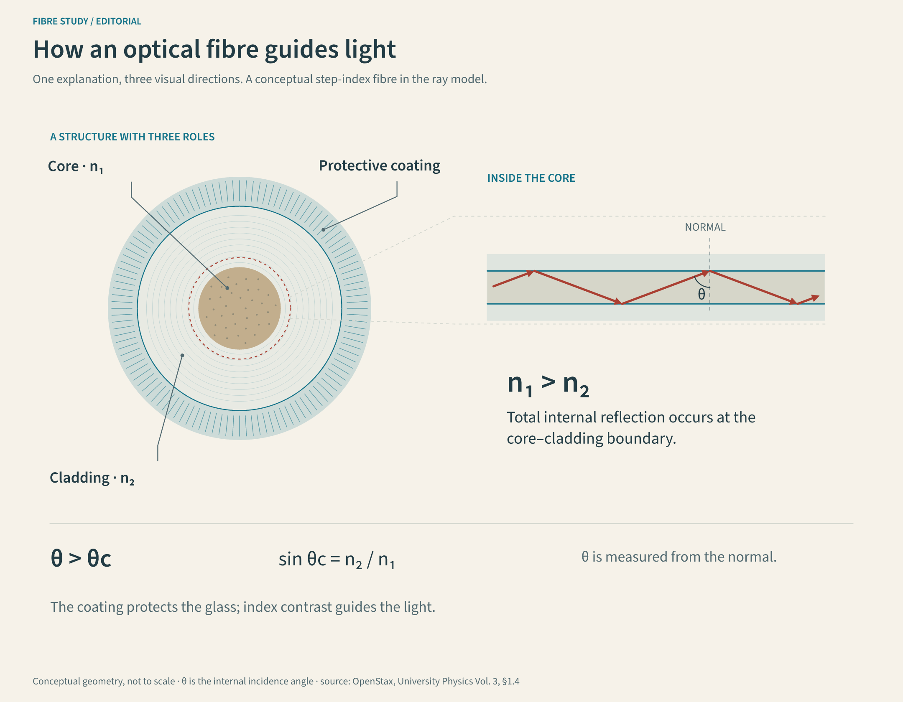
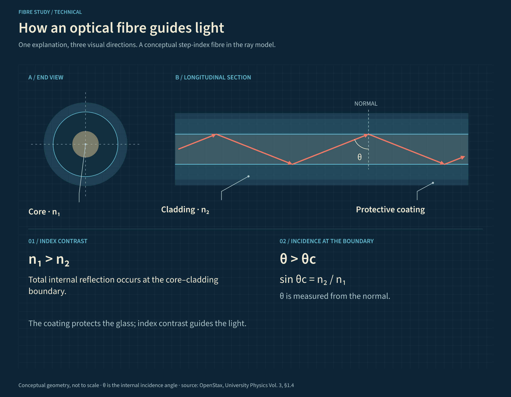
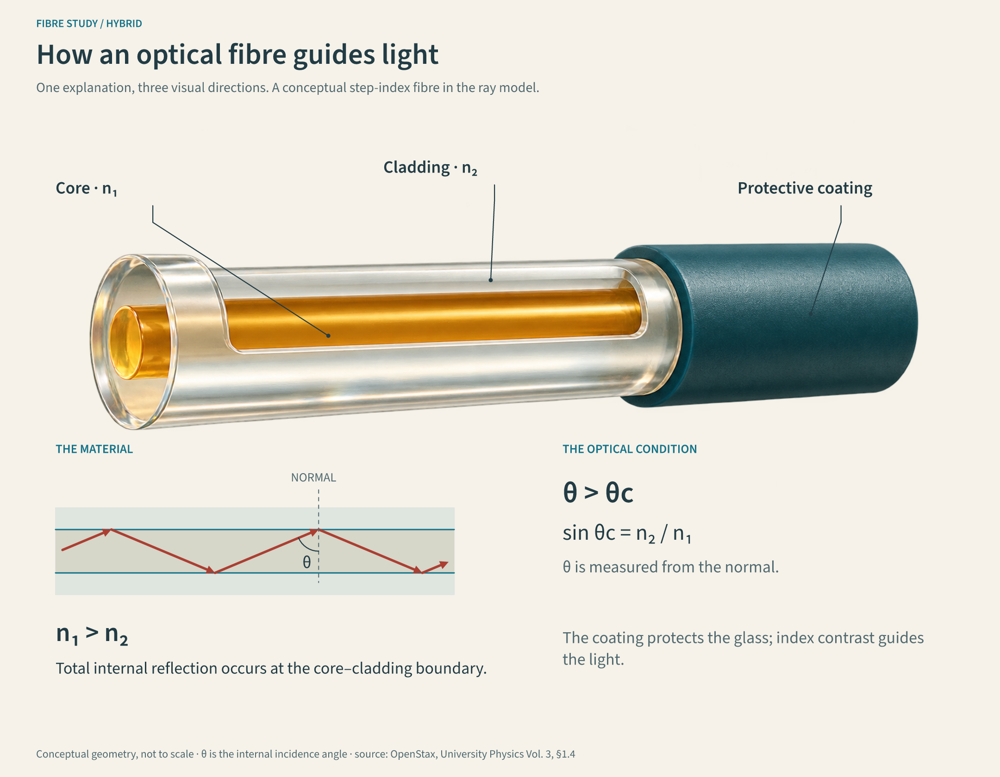

# One explanation, three visual directions

This local study compares three compositions for **how an optical fibre guides light**. The [shared brief](brief.json) fixes nine labels and claims, the source, scope, canvas and intended print width. Automated tests check that each variant retains every required text.

| Direction | Composition | Editing tradeoff |
| --- | --- | --- |
| Editorial | Engraved end view linked to a longitudinal detail on warm paper | Every mark and label is vector; textured detail is authored geometry |
| Technical | Orthographic end and side views on a blueprint grid | Direct comparison of layers and reflection; less material realism |
| Hybrid | Transparent glass cutaway with anchored labels and a vector ray inset | Richer material depiction; the illustration is raster, annotations are editable |

These are original compositions, not reproductions of a reference screenshot. Colours and proportions are illustrative. The explanation uses an ideal straight step-index fibre and the ray model; it does not claim measured dimensions or performance. The optical condition follows [OpenStax, University Physics Vol. 3, §1.4](https://openstax.org/books/university-physics-volume-3/pages/1-4-total-internal-reflection).

## Editorial



[Scene](editorial/scene.json) · [SVG](editorial/rendered/figure.svg) · [PDF](editorial/rendered/figure.pdf) · [Check report](editorial/rendered/report.json)

## Technical



[Scene](technical/scene.json) · [SVG](technical/rendered/figure.svg) · [PDF](technical/rendered/figure.pdf) · [Check report](technical/rendered/report.json)

## Hybrid



[Scene](hybrid/scene.json) · [SVG](hybrid/rendered/figure.svg) · [PDF](hybrid/rendered/figure.pdf) · [Check report](hybrid/rendered/report.json) · [Original transparent PNG](hybrid/assets/fibre-cutaway-v1.png) · [Exact prompt and provenance](hybrid/assets/generation-prompt.md)

The illustration was generated using the host's built-in image tool. The tool did not expose a model identifier or price, so neither is claimed. The original RGBA output is stored unchanged. Rendering uses that local file and makes no image-generation call.

Labels reference the image by ID and normalized anchor coordinates. Moving or resizing its placement updates endpoints. A new illustration can change the material positions, so anchors must be reviewed when replacing the image. The generated cutaway is conceptual: its amber core, glass highlights and exaggerated proportions are visual cues, not material measurements.

## Reproduce and revise

From the repository root:

```sh
npm ci
npm test
npm run examples
```

Change a callout's `text` in the hybrid `scene.json`, then render just that scene:

```sh
node bin/cli.js render examples/fiber-study/hybrid/scene.json --out output/fibre-revision --strict
```

The label is editable SVG/PDF text, while the image is embedded unchanged. The regression suite verifies that a label correction changes the text without changing the artwork bytes or asset hash.

For changes to the shared construction, edit `scripts/build-fiber-study.js` or `brief.json`, then run `npm run study`. This rebuilds and overwrites all three scenes and exports; it does not regenerate the illustration.

## Review at delivery size

The 1440 px canvas is intended for 180 mm report width. At that width, 24–26 px body labels correspond to approximately 8.5–9.2 pt; the 16 px source footer is approximately 5.7 pt and should be enlarged or moved into the report caption if the publication requires larger source text. The committed example PDFs retain native canvas dimensions. Export an explicitly sized version and inspect its text-size report with:

```sh
node bin/cli.js render examples/fiber-study/hybrid/scene.json --out output/fibre-print --print-width 180
node bin/cli.js check examples/fiber-study/hybrid/scene.json --print-width 180 --min-font 8 --json
```

The PDF page is 180 × 140 mm. SVG and PNG dimensions are unchanged. Small text is reported honestly; adding `--strict` rejects the current example at an 8 pt minimum until those labels are adjusted.

## Try a text revision

```sh
node bin/cli.js init my-fibre --example hybrid
node bin/cli.js revise my-fibre/scene.json --labels examples/fiber-study/revisions/core-label.json --out revised-fibre --strict
node bin/cli.js render revised-fibre/scene.json --out output/revised-fibre --strict
```

The [sample correction](revisions/core-label.json) changes only the core label. Both project folders must be new. The commands preserve the original project, copy the image bytes and validate the revised layout. Use `labels my-fibre/scene.json` to discover IDs for further corrections or translation.

Check the material at each leader endpoint, equal incidence/reflection angles, the angle measured from the normal, reading order and contrast in the final document. Mechanical validation does not establish scientific accuracy or print legibility. This study supports choosing a direction before introducing more illustration providers or additional subjects.
